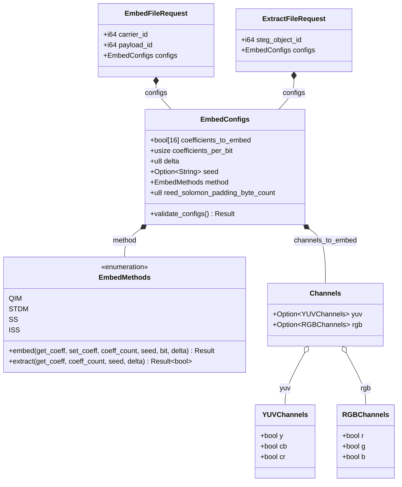
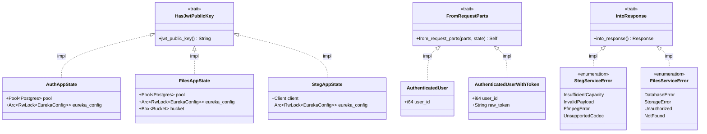
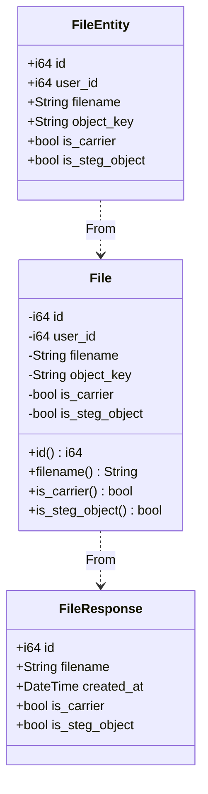

## 15.10 Design Class Diagram

### תפיסת העיצוב ב-Rust

ב-Rust אין מחלקות (classes) כמו ב-Java או Python. במקומן, המערכת בנויה על שלושה עקרונות מרכזיים:

**Struct ובלוק impl** — struct מגדיר את מבנה הנתונים, ובלוק impl מוסיף לו לוגיקה ומתודות. זהו המקביל הישיר למחלקה, אך ללא ירושה. לדוגמה, `EmbedConfigs` מגדיר את כל פרמטרי ההטמעה, ובלוק impl מוסיף לו את `validate_configs()`.

**Traits במקום ממשקים** — trait מגדיר חוזה התנהגותי שכל struct יכול לממש, בדומה ל-interface. הפרוייקט משתמש בכך ב-HasJwtPublicKey שמאלץ כל AppState לחשוף את המפתח הציבורי ל-JWT, וב-IntoResponse שמאלץ כל enum של שגיאות להיות מסוגל להפוך לתגובת HTTP — כך שגיאות לוגיות ושגיאות HTTP נשארות מופרדות ומחוברות דרך חוזה מוגדר היטב.

**Composition במקום ירושה** — struct אחד מכיל struct אחר כשדה. `EmbedFileRequest` מכיל `EmbedConfigs`, שמכיל `EmbedMethods` ו-`Channels`, שמכיל `YUVChannels`. כל רמה אחראית על חלקה בלבד. זוהי הגישה שהחליפה את הירושה המרובה — גמישה יותר, בטוחה יותר, ומונעת את הקישורים ההדוקים שנוצרים בהיררכיות ירושה עמוקות.

Rust למדה מהטעויות ההיסטוריות של OOP: ירושה מרובה מובילה לבלגן, היררכיות עמוקות קשות לשינוי, ופולימורפיזם דרך ירושה מייצר תלויות שקשה לשבור. Rust מחליפה את כל אלו בכלים מדויקים יותר ובטוחים יותר, תוך שמירה על אותן מטרות הנדסיות.

---

### תרשים 1 — ליבת שירות הסטגנוגרפיה

התרשים מציג את שרשרת ה-composition שמובילה מבקשת המשתמש עד לבחירת האלגוריתם. `EmbedMethods` הוא enum עם בלוק impl — כל ערך (QIM, STDM, SS, ISS) מיישם את אותה התנהגות דרך `match` פנימי. זהו הפולימורפיזם של Rust: במקום מחלקות בנות שעוקפות מתודה ב-superclass, יש enum שמפרק את ההתנהגות בצורה בטוחה וסגורה בזמן קומפילציה.

---

### תרשים 2 — Traits חוצי-שירות

שלושה traits מרכזיים קושרים את השירותים השונים ללא תלות ישירה ביניהם:

- **HasJwtPublicKey** — כל AppState חייב לממש trait זה כדי שה-extractors של Axum יוכלו לשלוף ממנו את המפתח לאימות JWT. זה מאפשר לקוד האימות לעבוד עם כל שירות בלי לדעת את הטיפוס הספציפי שלו.
- **FromRequestParts** — trait של Axum שה-extractors מממשים כדי לשלוף מידע מה-HTTP request (JWT, user_id, טוקן גולמי). הממשק אחיד — Axum קורא לו אוטומטית לפני כל handler.
- **IntoResponse** — trait של Axum שכל enum שגיאות מממש. מבטיח שכל שגיאה לוגית יודעת להפוך לתגובת HTTP עם status code מתאים, בלי לפזר לוגיקת HTTP בתוך ה-handlers.

---

### תרשים 3 — שרשרת Entity → Domain Model → DTO

דפוס זה מופיע בשלושה שירותים (auth, user, files). ה-Entity הוא שורת DB גולמית עם `#[derive(sqlx::FromRow)]`. ה-Domain Model מסתיר את השדות, חושף רק getters, ומוסיף לוגיקה (כמו `verify_password`, `is_expired`). ה-DTO הוא המבנה שנשלח בתגובת HTTP — ממוען לצורכי הלקוח בלבד. הפרדה זו מונעת חשיפה לא מכוונת של שדות פנימיים (כמו `password_hash`) לתגובות ה-API.

---

### פונקציות משמעותיות בליבת המערכת

| פונקציה | שירות | תיאור |
|---|---|---|
| `embed(payload_path, carrier_path, configs)` | steganography | מתזמר את כל pipeline ההטמעה: פותח carrier דרך ffmpeg, קורא payload בביטים, מריץ DCT על כל I-frame, מקודד ביטים דרך האלגוריתם הנבחר, מריץ IDCT וכותב לקובץ פלט |
| `extract(object_path, configs)` | steganography | Pipeline הפוך: מפענח steg object דרך ffmpeg, שולף ביטים דרך DCT, מפרסר 64 ביט ראשונים כ-header לגודל ה-payload, עוצר כשחולץ מספיק בתים |
| `EmbedMethods::embed(get_coeff, set_coeff, ...)` | steganography | dispatch פולימורפי לאלגוריתם הנבחר — QIM, STDM, SS או ISS — דרך match על ה-enum |
| `process_frame<F, T, W>(configs, state, buffer, frame, channel_fn)` | steganography | גנרי על שני ה-pipelines — מקבל פונקציית ערוץ כ-closure ומפעיל אותה על כל מישור YUV/RGB |
| `generate_unit_vector(seed, size)` | steganography | מייצר וקטור יחידה פסאודו-אקראי דטרמיניסטי: SHA256 של ה-seed → u64 → StdRng → ערכים ב-[-1,1] → נרמול. בסיס לכל אלגוריתמי STDM, SS, ISS |
| `register_user(pool, user_service_url, ...)` | auth | מיישם saga: hashing → יצירת משתמש ב-user_service → שיוך תפקיד ב-auth DB → compensation עד 3 ניסיונות אם שיוך נכשל |
| `refresh_access_token(pool, token, ...)` | auth | token rotation: מחפש token לפי hash, בודק תפוגה, מוחק ישן ומנפיק חדש בלי תלות בתפוגה, שומר device_info |
| `complete_upload(bucket, pool, payload, user_id)` | files | מסיים multipart upload ב-MinIO, מוריד 2MB ראשונים ומריץ ffmpeg לגילוי קודק, שומר is_carrier בהתאם לתוצאה |
| `dct_ii(pixels)` / `idct_ii(coefficients)` | steganography | DCT ו-IDCT על בלוק 4x4 — המרה בין תחום הפיקסלים לתחום התדרים ובחזרה |
| `compensate_delete_user(url, user_id)` | auth | לולאת retry עד 3 פעמים למחיקת משתמש ב-user_service כחלק מ-saga compensation |
