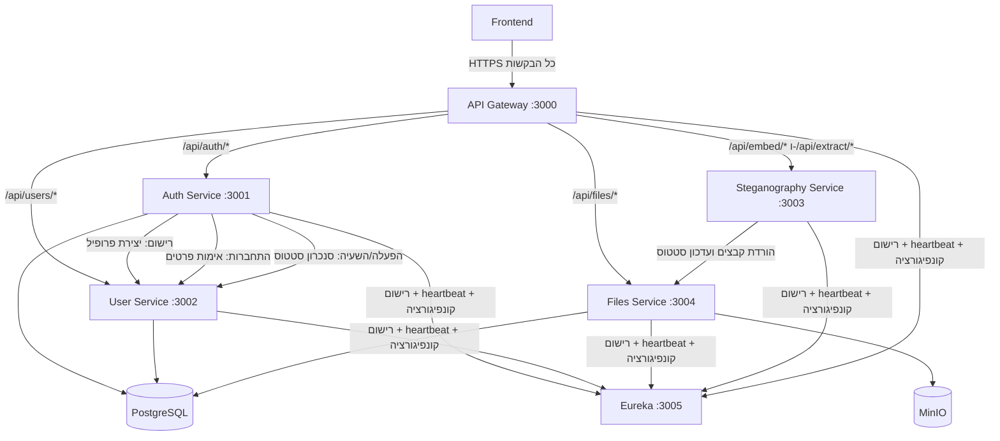

### 15.5 הקשרים בין היחידות השונות

כל תקשורת בין שירותים מתבצעת על גבי HTTP. כתובות השירותים אינן מקודדות בקוד - כל שירות שואל את Eureka בזמן ריצה לכתובת השירות שהוא צריך לפנות אליו.

**API Gateway**
ה-Gateway מממש פרוקסי שקוף: קורא כתובת שירות היעד מ-Eureka, מסיר את הקידומת `/api`, ומעביר את הבקשה המלאה כולל כותרות וגוף בסטרימינג ישיר ללא בופרינג. אם שירות היעד לא נמצא ב-Eureka מוחזר 503.

**Auth Service ↔ User Service**
שני שירותים אלו שותפים בתהליכים מרכזיים ומתקשרים ישירות:
- רישום: Auth יוצר את רשומת האימות, ואז קורא ל-User ליצירת הפרופיל. אם יצירת הפרופיל מצליחה אך הקצאת התפקיד ב-Auth נכשלת, Auth מבצע פעולת פיצוי ומוחק את הפרופיל מ-User - עד 3 ניסיונות.
- התחברות: Auth קורא לנתיב פנימי ב-User לאימות הסיסמה.
- הפעלה/השעיה: Auth מסנכרן שינוי סטטוס ל-User.

**Steganography Service ↔ Files Service**
בכל בקשת הטמעה או חילוץ, שירות הסטגנוגרפיה מוריד קבצים משירות הקבצים ישירות (metadata ואז תוכן), ובסיום מעלה את הפלט חזרה ל-Files Service תוך שימוש באותו תהליך multipart שהמשתמש משתמש בו. לאחר ההעלאה מתבצעת קריאה לנתיב פנימי לסימון הקובץ כ-steg object.

**JWT**
המפתח הפרטי לחתימת טוקנים נמצא על Auth Service בלבד. שאר השירותים מקבלים את המפתח הציבורי דרך תצורת Eureka ומאמתים טוקנים באופן עצמאי ללא פנייה חזרה ל-Auth.
