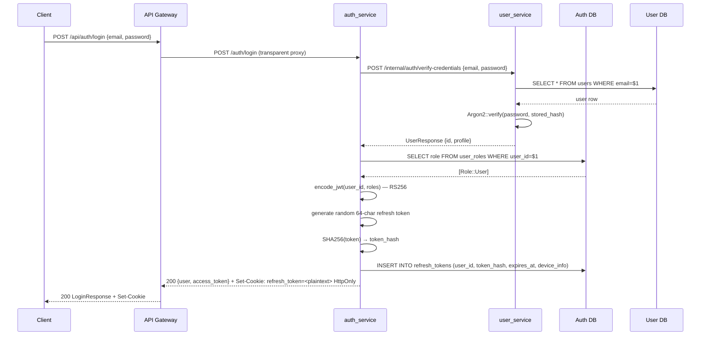
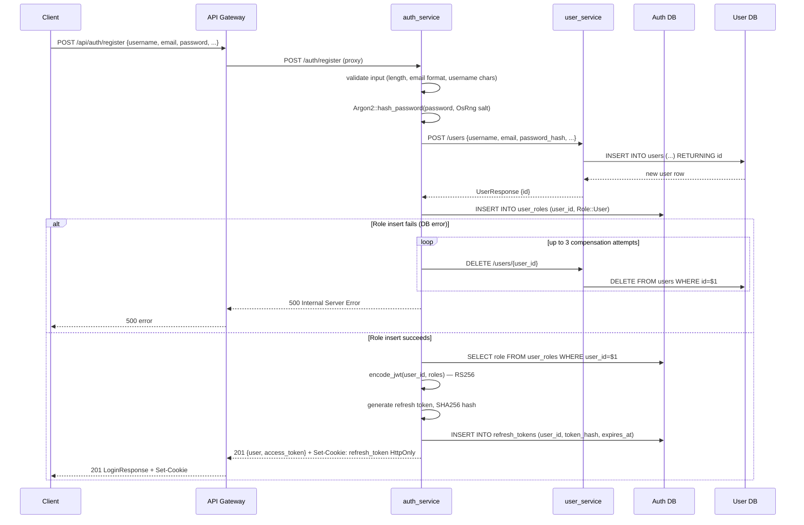
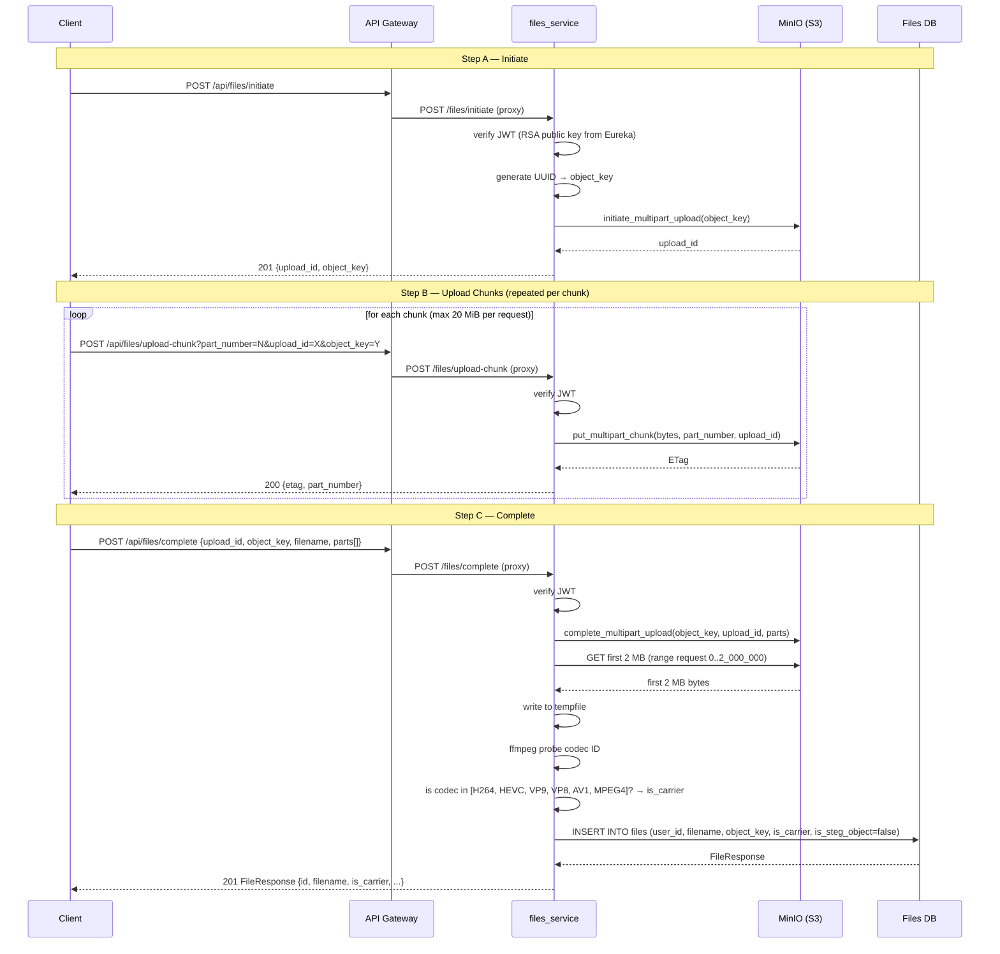
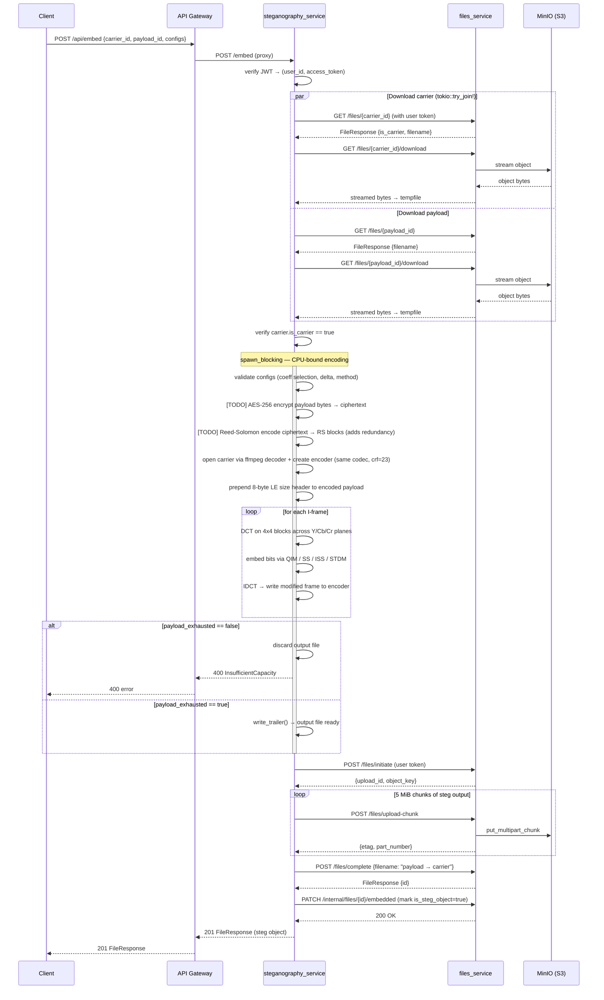
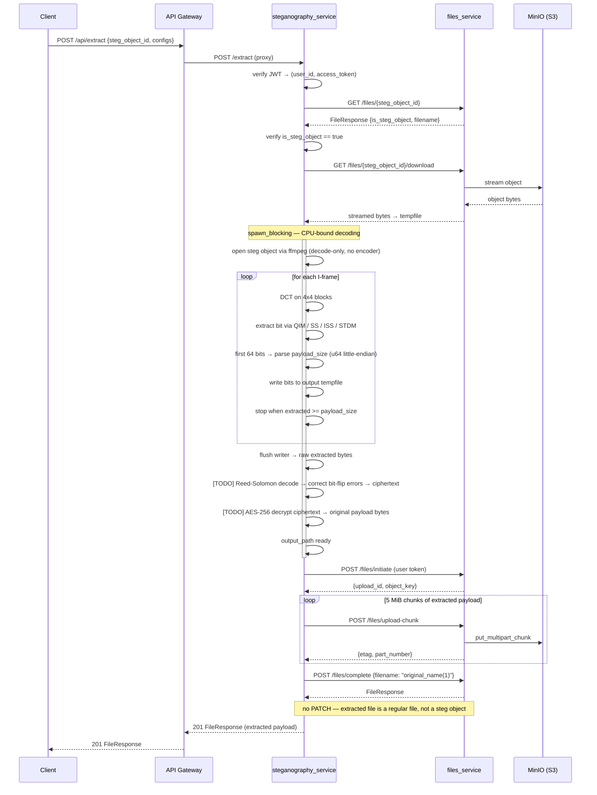
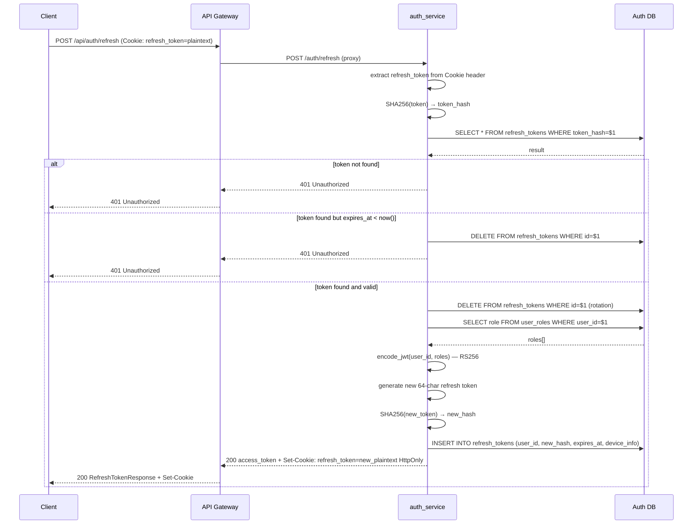

## 15.9 תרשימי UML — Sequence Diagrams

בחלק זה מוצגים תרשימי רצף עבור ששת הזרימות הלא-טריוויאליות במערכת. כל תרשים מציג את זרימת המידע בין הרכיבים השונים, כולל קריאות בין-שירותיות, פעולות בסיסי הנתונים, ונקודות כשל.

---

### 15.9.1 התחברות (Login)

בזרימת ההתחברות, אימות הסיסמה מתבצע בשירות המשתמשים בעזרת Argon2, ואחר כך שירות ה-Auth מייצר JWT ו-Refresh Token. הטוקן עצמו נשמר בבסיס הנתונים רק כ-hash (SHA256) ומועבר ללקוח כ-HttpOnly cookie.

---

### 15.9.2 הרשמה עם saga compensation (Register)

הרשמה מיישמת דפוס saga: יצירת המשתמש ב-user_service ושיוך התפקיד ב-Auth DB הן שתי פעולות עצמאיות על שני בסיסי נתונים נפרדים. אם שיוך התפקיד נכשל, מתבצע ניסיון מחיקה מפצה ב-user_service עד שלוש פעמים. אם כל הניסיונות נכשלים, הפרופיל נשאר ב-user_service ללא תפקיד — מצב המונע כניסה עתידית.

---

### 15.9.3 העלאת קובץ (File Upload — S3 Multipart)

העלאת קובץ מתבצעת בשלושה שלבים נפרדים לפי פרוטוקול S3 Multipart. בשלב ה-Complete, המערכת מורידה את 2 ה-MB הראשונים מ-MinIO ומגלה את הקודק בעזרת ffmpeg כדי לסמן האם הקובץ מתאים לשמש carrier לסטגנוגרפיה.

---

### 15.9.4 הטמעת מידע (Embed Pipeline)

זרימת ה-Embed מורידה את שני הקבצים במקביל בעזרת `tokio::try_join!`, מריצה את אלגוריתם ה-DCT בthread נפרד (spawn_blocking) כדי לא לחסום את ה-async runtime, ומעלה את הפלט ל-files_service בפרוטוקול ה-S3. בסיום, קריאת PATCH פנימית מסמנת את הקובץ כ-steg object. לפני ההטמעה, ה-payload עובר הצפנת AES-256 ואחר כך קידוד Reed-Solomon להוספת יתירות לתיקון שגיאות (TODO).

---

### 15.9.5 חילוץ מידע (Extract Pipeline)

זרימת ה-Extract מורידה קובץ steg אחד, מפעילה את אלגוריתם החילוץ בthread נפרד, ומעלה את הפלט. בשונה מה-Embed, לא מתבצעת קריאת PATCH — הקובץ שנחלץ מוחזר כקובץ רגיל. שם הקובץ נגזר מהמקורי: `"payload → carrier"` מפוצל על `" → "` ולחצי הראשון מתווספת הסיומת `"(1)"`. לאחר חילוץ הביטים, מתבצע פענוח Reed-Solomon לתיקון שגיאות ואחר כך פענוח AES-256 לשחזור ה-payload המקורי (TODO).

---

### 15.9.6 חידוש טוקן (Token Refresh)

Refresh Token מאוחסן בבסיס הנתונים רק כ-SHA256 hash. בכל קריאת refresh מתבצעת token rotation ללא תלות בשאלה האם הטוקן עדיין בתוקף — הטוקן הישן מבוטל ומוחלף בחדש. פרטי המכשיר (device_info) עוברים לטוקן החדש.

