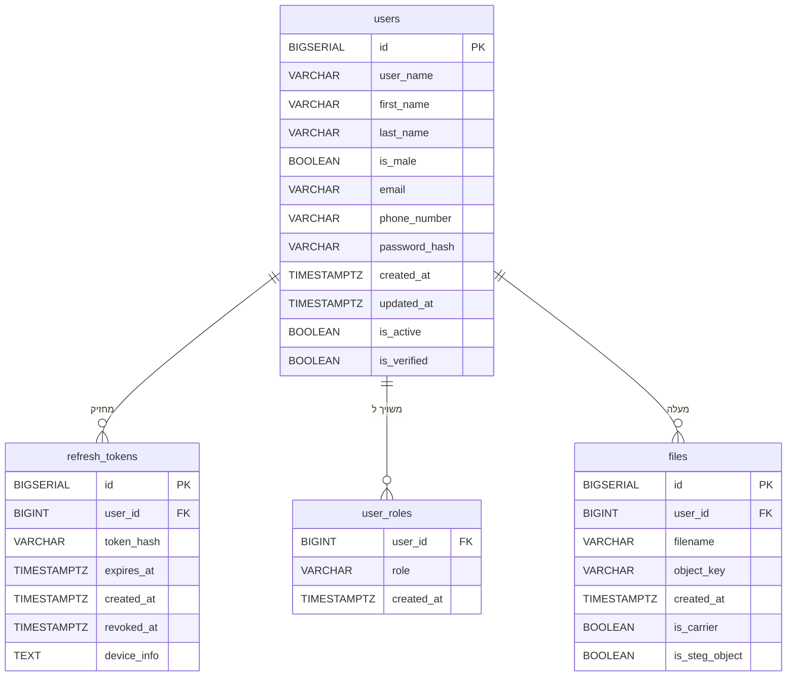

# תיעוד פרויקט - פלטפורמת סטגנוגרפיה בווידאו

---

## 22 — תיאור מסד הנתונים

### סקירה כללית

מסד הנתונים של המערכת מבוסס על PostgreSQL ומנוהל דרך SQLx עם מיגרציות גרסאות. הוא מחולק בין שניים מהשירותים: `auth_service` ו-`user_service` מנהלים ביחד את נתוני המשתמשים, הסשנים והרשאות הגישה, בעוד `files_service` מנהל את המטה-נתונים של הקבצים.

המידע הבינארי (קובצי הווידאו עצמם) אינו נשמר בתוך PostgreSQL — הוא מאוחסן ב-MinIO (שירות אחסון תואם S3). מסד הנתונים שומר רק את ה-metadata של כל קובץ, כולל מפתח האחסון (`object_key`) שמצביע לאחסון החיצוני.

המערכת כוללת ארבע טבלאות:

| טבלה | שירות | תפקיד |
|---|---|---|
| `users` | `user_service` | פרטי המשתמשים הרשומים |
| `refresh_tokens` | `auth_service` | טוקני רענון פעילים לניהול סשן |
| `user_roles` | `auth_service` | הרשאות RBAC לכל משתמש |
| `files` | `files_service` | רשומות מטה-נתונים של קבצים |

---

### תרשים ERD — קשרים בין הישויות



כל הקשרים הם one-to-many מ-`users`. ה-FK הלוגי הוא `user_id` בכל אחת מהטבלאות הבנות, שמפנה ל-`id` של הטבלה `users`. חשוב לציין שאין הגדרת `FOREIGN KEY` מפורשת ב-DDL — שלמות הפניה מובטחת ברמת שכבת השירות בקוד ה-Rust, גישה נפוצה בארכיטקטורת microservices שבה כל שירות מחזיק בשלמות הנתונים שלו.

---

### 22.1 — טבלת `users`

**תפקיד הטבלה:** שמירת פרטי כל משתמש רשום במערכת. היא הטבלה המרכזית (root entity) שממנה נגזרות שאר הטבלאות.

| עמודה | סוג נתונים | חובה | ברירת מחדל | תפקיד |
|---|---|---|---|---|
| `id` | `BIGSERIAL` | כן | auto-increment | מפתח ראשי (PK) — מזהה ייחודי של המשתמש |
| `user_name` | `VARCHAR(255)` | כן | — | שם משתמש, ייחודי בכל המערכת (UNIQUE) |
| `first_name` | `VARCHAR(255)` | כן | — | שם פרטי |
| `last_name` | `VARCHAR(255)` | כן | — | שם משפחה |
| `is_male` | `BOOLEAN` | לא | NULL | מגדר, שדה אופציונלי |
| `email` | `VARCHAR(255)` | כן | — | כתובת מייל, ייחודית (UNIQUE), משמשת גם לכניסה |
| `phone_number` | `VARCHAR(20)` | לא | NULL | מספר טלפון, אופציונלי |
| `password_hash` | `VARCHAR(255)` | כן | — | תוצאת גיבוב Argon2 של הסיסמה — הסיסמה המקורית אינה נשמרת לעולם |
| `created_at` | `TIMESTAMPTZ` | כן | `CURRENT_TIMESTAMP` | חותמת זמן יצירת הרשומה, עם timezone |
| `updated_at` | `TIMESTAMPTZ` | כן | `CURRENT_TIMESTAMP` | חותמת זמן עדכון אחרון — מתעדכנת אוטומטית על ידי trigger |
| `is_active` | `BOOLEAN` | כן | `TRUE` | האם החשבון פעיל — ניתן להשעיית משתמש ללא מחיקה |
| `is_verified` | `BOOLEAN` | כן | `FALSE` | האם המשתמש אימת את כתובת המייל שלו |

**אינדקסים:**

| שם האינדקס | עמודה | מטרה |
|---|---|---|
| `idx_users_email` | `email` | האצת חיפוש בכניסה לפי מייל |
| `idx_users_username` | `user_name` | האצת חיפוש בכניסה לפי שם משתמש |

---

### 22.2 — טבלת `refresh_tokens`

**תפקיד הטבלה:** שמירת כל טוקני הרענון הפעילים והמבוטלים. בעת כניסה, נוצרת רשומה חדשה. בעת יציאה או חשד לניצול לרעה, הרשומה מסומנת כמבוטלת (revoked) מבלי להימחק, לצרכי audit.

| עמודה | סוג נתונים | חובה | ברירת מחדל | תפקיד |
|---|---|---|---|---|
| `id` | `BIGSERIAL` | כן | auto-increment | מפתח ראשי (PK) |
| `user_id` | `BIGINT` | כן | — | מזהה המשתמש שאליו שייך הטוקן (FK לוגי → `users.id`) |
| `token_hash` | `VARCHAR(64)` | כן | — | גיבוב SHA-256 של הטוקן הגולמי — הטוקן המקורי לא נשמר, רק גיבובו |
| `expires_at` | `TIMESTAMPTZ` | כן | — | זמן פקיעת תוקף הטוקן |
| `created_at` | `TIMESTAMPTZ` | כן | `CURRENT_TIMESTAMP` | זמן הנפקת הטוקן |
| `revoked_at` | `TIMESTAMPTZ` | לא | NULL | אם מולא — הטוקן בוטל בזמן זה; NULL פירושו שהטוקן עדיין בתוקף |
| `device_info` | `TEXT` | לא | NULL | מידע על המכשיר שממנו נוצר הסשן (user-agent וכו') |

**אינדקסים:**

| שם האינדקס | עמודה | מטרה |
|---|---|---|
| `idx_refresh_tokens_user_id` | `user_id` | שליפת כל הסשנים הפעילים של משתמש |
| `idx_refresh_tokens_token_hash` | `token_hash` | אימות מהיר של טוקן נכנס |
| `idx_refresh_tokens_expires_at` | `expires_at` | ניקוי תקופתי של טוקנים שפג תוקפם |

**הערה אבטחתית:** שמירת גיבוב הטוקן ולא ערכו הגולמי מבטיחה שגם דליפת מסד הנתונים לא תאפשר לתוקף להשתמש בטוקנים גנובים.

---

### 22.3 — טבלת `user_roles`

**תפקיד הטבלה:** מימוש מנגנון RBAC (Role-Based Access Control). במקום עמודת "רמת הרשאה" פשוטה בתוך טבלת המשתמשים, הטבלה מאפשרת להקצות למשתמש מספר תפקידים בו-זמנית, מה שנותן גמישות מלאה בניהול הרשאות.

| עמודה | סוג נתונים | חובה | ברירת מחדל | תפקיד |
|---|---|---|---|---|
| `user_id` | `BIGINT` | כן | — | מזהה המשתמש (חלק ממפתח מורכב, FK לוגי → `users.id`) |
| `role` | `VARCHAR(50)` | כן | — | שם התפקיד (לדוגמה: `"admin"`, `"user"`) |
| `created_at` | `TIMESTAMPTZ` | כן | `CURRENT_TIMESTAMP` | מתי הוקצה התפקיד |

**מפתח ראשי מורכב:** `PRIMARY KEY (user_id, role)` — הצמד (משתמש + תפקיד) הוא ייחודי, כך שאותו תפקיד לא יוכל להיות מוקצה פעמיים לאותו משתמש.

**אינדקסים:**

| שם האינדקס | עמודה | מטרה |
|---|---|---|
| `idx_user_roles_user_id` | `user_id` | שליפת כל ההרשאות של משתמש נתון |

---

### 22.4 — טבלת `files`

**תפקיד הטבלה:** שמירת מטה-נתונים של כל קובץ שהועלה על ידי משתמש. תוכן הקובץ עצמו נמצא ב-MinIO; הטבלה מחזיקה את `object_key` שמשמש כמפתח לאחזורו.

| עמודה | סוג נתונים | חובה | ברירת מחדל | תפקיד |
|---|---|---|---|---|
| `id` | `BIGSERIAL` | כן | auto-increment | מפתח ראשי (PK) |
| `user_id` | `BIGINT` | כן | — | מזהה הבעלים של הקובץ (FK לוגי → `users.id`) |
| `filename` | `VARCHAR(255)` | כן | — | שם הקובץ כפי שהועלה על ידי המשתמש |
| `object_key` | `VARCHAR(255)` | כן | — | מפתח ייחודי (UNIQUE) לאחסון הקובץ ב-MinIO |
| `created_at` | `TIMESTAMPTZ` | כן | `CURRENT_TIMESTAMP` | זמן העלאת הקובץ |
| `is_carrier` | `BOOLEAN` | כן | `FALSE` | האם הקובץ הוגדר כ-carrier — ווידאו מוכן לקלוט מטען נסתר |
| `is_steg_object` | `BOOLEAN` | כן | `FALSE` | האם הקובץ הוא תוצאת תהליך הטמעה — ווידאו עם מטען מוטמע |

**הערה:** הפרדת `filename` מ-`object_key` היא מכוונת. ה-`object_key` מיוצר עם UUID ייחודי בעת ההעלאה, מה שמונע התנגשות שמות ומאפשר לשני משתמשים שונים להעלות קבצים עם אותו שם ללא קונפליקט.

---

### 22.5 — Trigger: `update_users_updated_at`

המערכת כוללת trigger מסוג `BEFORE UPDATE` על טבלת `users`:

```sql
CREATE OR REPLACE FUNCTION update_updated_at_column()
RETURNS TRIGGER AS $$
BEGIN
    NEW.updated_at = CURRENT_TIMESTAMP;
    RETURN NEW;
END;
$$ language 'plpgsql';

CREATE TRIGGER update_users_updated_at
BEFORE UPDATE ON users
FOR EACH ROW EXECUTE FUNCTION update_updated_at_column();
```

**הסבר:** בכל עדכון של שורה בטבלת `users`, ה-trigger מריץ את הפונקציה `update_updated_at_column()` שמעדכנת אוטומטית את שדה `updated_at` לזמן הנוכחי. הגישה הזאת מבטיחה שעדכון הזמן לא תלוי בשכבת האפליקציה — הוא מתבצע תמיד ברמת מסד הנתונים, ולכן לא יפספס עדכונים שמגיעים ממקורות שונים.

---

### 22.6 — סיכום אינדקסים ואופטימיזציה

| טבלה | אינדקס | עמודות | סיבה |
|---|---|---|---|
| `users` | `idx_users_email` | `email` | כניסה לפי מייל |
| `users` | `idx_users_username` | `user_name` | כניסה לפי שם משתמש |
| `refresh_tokens` | `idx_refresh_tokens_user_id` | `user_id` | שליפת סשנים של משתמש |
| `refresh_tokens` | `idx_refresh_tokens_token_hash` | `token_hash` | אימות טוקן |
| `refresh_tokens` | `idx_refresh_tokens_expires_at` | `expires_at` | ניקוי טוקנים שפגו |
| `user_roles` | `idx_user_roles_user_id` | `user_id` | שליפת הרשאות משתמש |

האינדקס על `expires_at` בטבלת `refresh_tokens` מיועד לתמוך בתהליך ניקוי תקופתי שמוחק טוקנים שפג תוקפם, כך שהטבלה לא תצטבר ללא הגבלה לאורך זמן.
